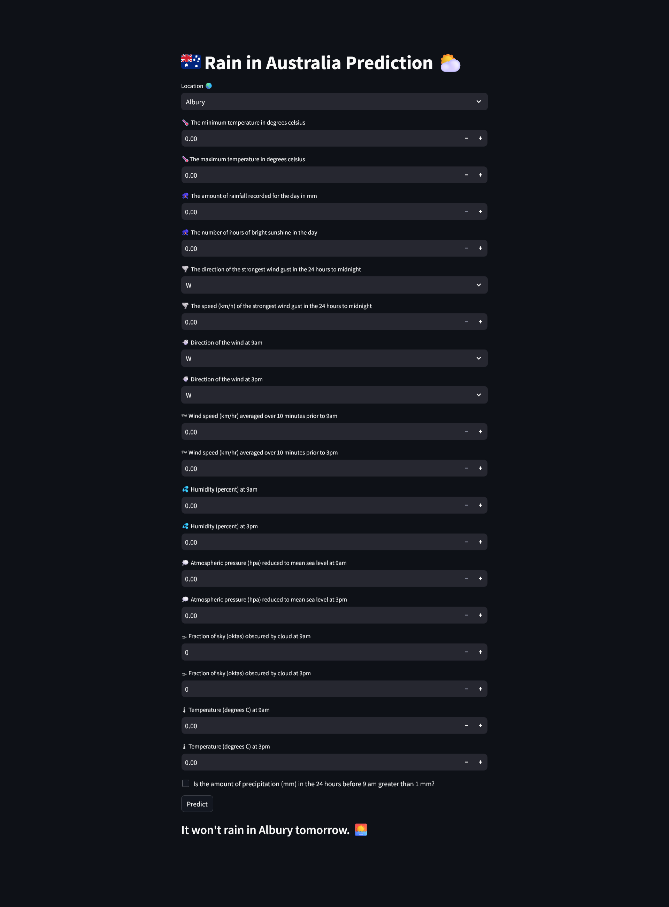

# Rain in Australia Prediction

[](https://rain-in-australia-prediction.onrender.com/)

This classification project focuses on predicting whether it will rain in various cities across Australia tomorrow. The outcomes of this project will enhance the ability to anticipate rain events, aiding in decision-making for individuals and organizations reliant on accurate weather predictions in different regions of Australia


## Dataset
https://www.kaggle.com/datasets/jsphyg/weather-dataset-rattle-package


## Libraries
| Part                 | Libs                     | 
| -------------------- | ------------------------ |  
| Data Manipulation    | `pandas` `numpy`        |
| Data Visualization   | `matplotlib` `seaborn`  |   
| Application          | `streamlit` |  


## Setting up a project

#### 1) Clone the repository
```
git clone https://github.com/VladHolobyn/rain-in-australia-prediction.git
cd rain-in-australia-prediction
```

#### 2) Create an environment

Windows:
```
py -3 -m venv env
env\Scripts\activate
```
macOS/Linux:
```
python3 -m venv env
. env/bin/activate
```

#### 3) Install requirements
```
pip install -r requirements.txt
```

#### 4) Run application
```
streamlit run run.py
```


## Preview 
